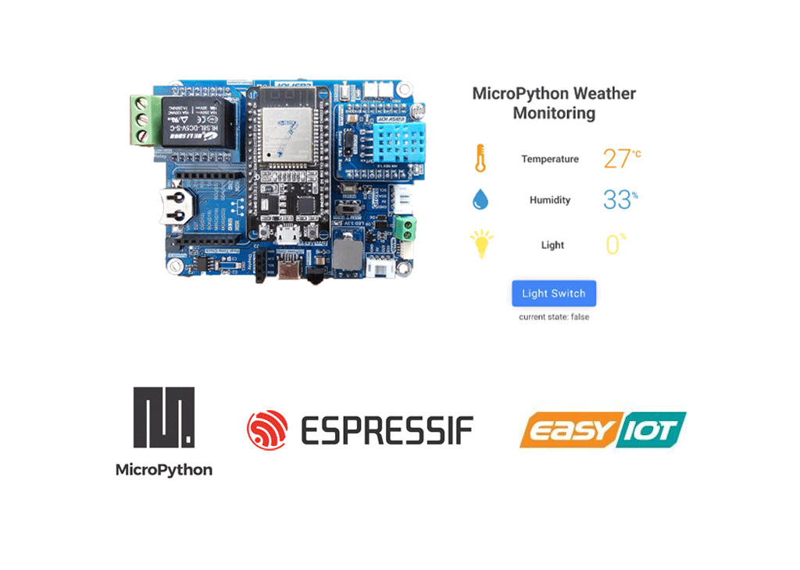
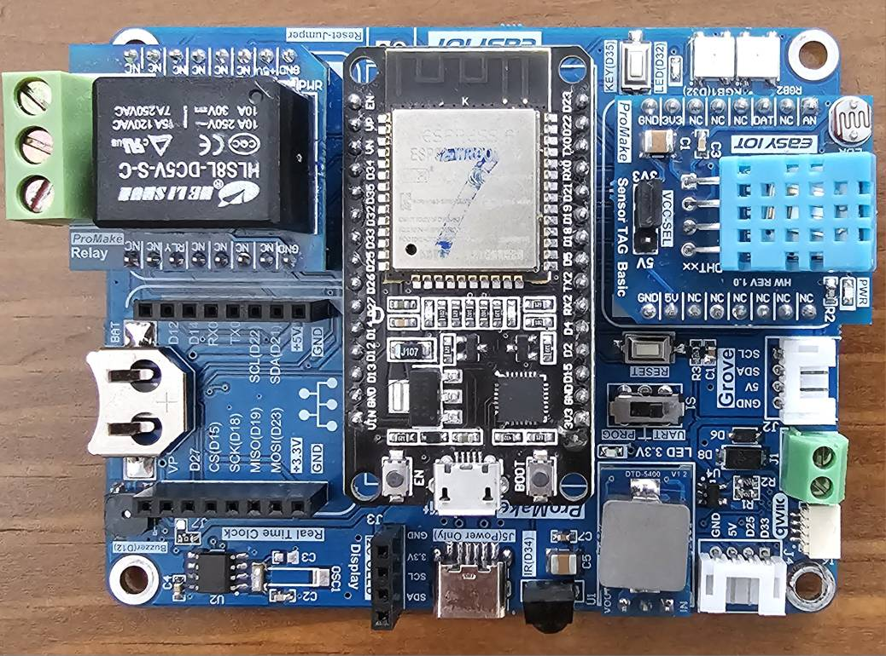
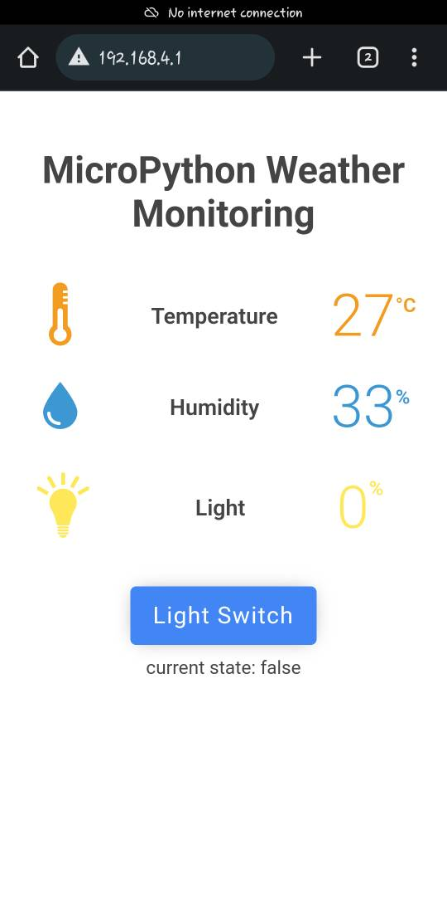

<h1 align="center">MicroPython ProMake WeatherMonitoring Web App</h1>


<div align="center" ><a href="https://easy-iot.ir"></a></div>

<h3 align="center">a web app application to show you the usage of webserver in micropython for reading and controlling modules</h3>
<p align="center">
<a href="https://www.micropython.org/" target="_blank">  </a> 
<a href="https://www.easy-iot.ir/" target="_blank">  </a> 
<a href="https://gigapardaz.com/" target="_blank">  </a> 
<a href="https://www.raspberrypi.com/" target="_blank">  </a> 
</p>

### Overview
- [Features](#features)
- [Assemble](#assemble)
- [Setup](#setup)
- [Demo](#demo)
- [License](#license)
- [Bugs or Opinion](#bugs-or-opinion)


# Features
- MicroPython
- DHT
- Photocel
- Relay
- Microdot
- ESP32

# Assemble
as i am using the easy iot boards for development all i needed to do was to mount 2 modules on the board and get ready to use it.

<div align="center" ></div>


# Setup
all you need to do is to upload the code to the board and after startup. you can connect to the board though wifi and the access point which as been created in the ```boot.py``` after that you will see the below screen.

<div align="center" ></div>

you can see the measurements update for every 5 seconds and you can also control the relay with the button assigned to it.


# Demo
a little demonstration of the the board workflow can be found here:

<div align="center" ></div>


# License
MIT

# Bugs or Opinion
Feel free to let me know if there are any problems or any request you have for this repo.
